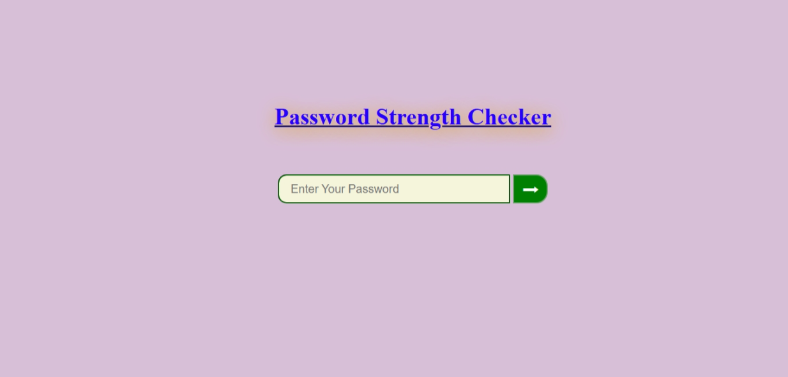
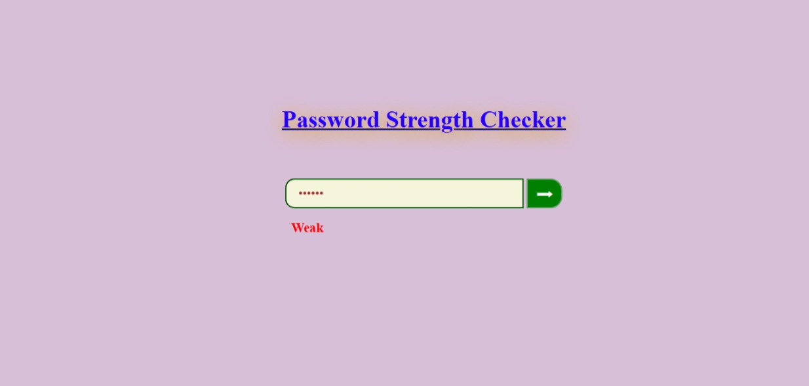
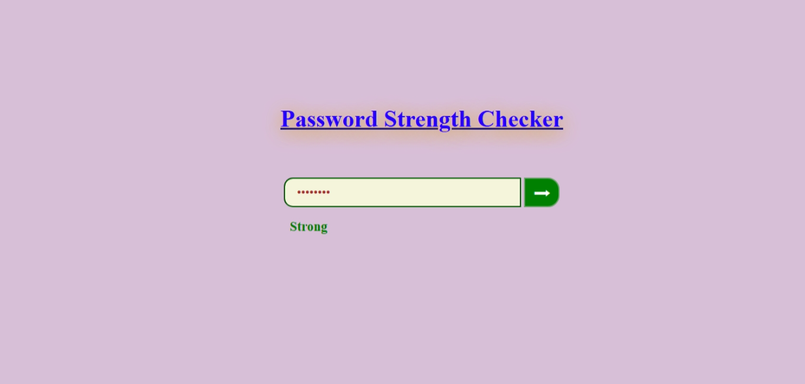
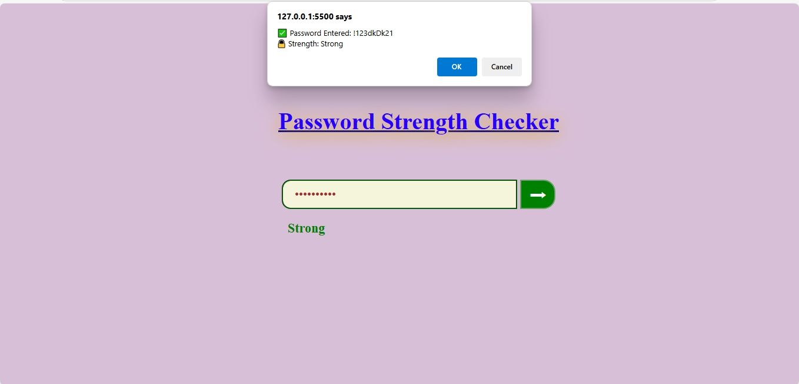

# 🔐 Password Strength Validator

A dynamic password strength checker that validates user input based on multiple criteria such as uppercase, lowercase, numbers, special characters, and length. Displays the strength (Weak, Medium, Strong) in real-time with appropriate color codes.

## 🚀 Live Demo

[Click here to view the live project](https://msdhinesh45.github.io/password-strength-checker/)

---

## 📸 Output Screenshots

| Screenshot 1 | Screenshot 2 |
|--------------|--------------|
|  |  |

| Screenshot 3 | Screenshot 4 |
|--------------|--------------|
|  |  |

---

## ✅ Features

- Real-time password strength feedback.
- Validates:
  - ✅ Uppercase letters
  - ✅ Lowercase letters
  - ✅ Numbers
  - ✅ Special characters
  - ✅ Minimum length (8+)
- Color-coded strength indication:
  - 🔴 Weak
  - 🟠 Medium
  - 🟢 Strong
- Alerts with password and strength on submit.

---

## 📄 License

This project is licensed under the [Apache License 2.0](LICENSE).

---

## 🛠️ Technologies Used

- HTML
- CSS
- JavaScript

---

## 👨‍💻 Author

**Dhinesh Kumar**

---

## 📬 Contact

If you have any feedback or questions, feel free to reach out via GitHub Issues.

